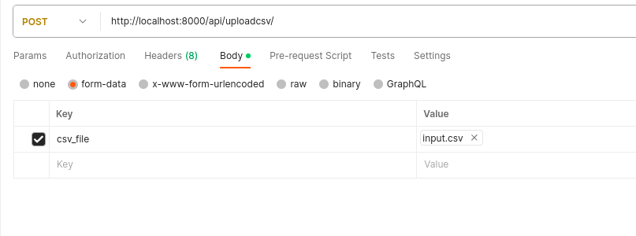

This is the API documentation for available endpoints in this API.


## List availabe endpoints 
    GET http://localhost:8000/api/
## List 
To list all the todo items in the database with default pagination settings, send a get request to the following endpoint.

    GET http://localhost:8000/api/items

```
{
    "count": 6,
    "next": "http://localhost:8000/api/items/?page=2",
    "previous": null,
    "results": [
        {
            "id": 1,
            "title": "Task 1",
            "description": "Description 1",
            "completed": false
        },
        {
            "id": 2,
            "title": "Task 2",
            "description": "Description 2",
            "completed": false
        },
        {
            "id": 3,
            "title": "Task 3",
            "description": "Description 3",
            "completed": true
        },
        {
            "id": 4,
            "title": "Task 4",
            "description": "Description 1",
            "completed": false
        },
        {
            "id": 5,
            "title": "Task 5",
            "description": "Description 2",
            "completed": false
        }
    ]
}
```
**Query Paramters :**
You can filter the desired output by using query paramters. For eg:

- Search in id, title or description: 
    ```
    GET http://localhost:8000/api/items?search=4
    ```
    ```
    GET http://localhost:8000/api/items?search=ask
    ```
- Search by property:
    ```
    GET http://localhost:8000/api/items?id=3
    ```
    ```
    GET http://localhost:8000/api/items?completed=false
    ```
- Ordering by property:
    ```
    GET http://localhost:8000/api/items?ordering=completed
    ```
    This retrieves the items with `completed=false` at the begining and the ones with `true` at the last.

    For **descending** order, add a `-` before the property.
    ```
    GET http://localhost:8000/api/items?ordering=-completed
    ```
- Pagination 

    You can retrieve a certain page number, or control the count of items that you want to retrieve.
    ```
    GET http://localhost:8000/api/items?page=2&count=2
    ```


## Create
You can create new item/items either by sending a post request with json data directly or in bulk through a csv file.

    ```
    POST http://localhost:8000/api/items
    ```
## Retrieve
Retrieve details of a specific item by sending GET request at.

    
    GET http://localhost:8000/api/items/pk
    
## Update
Update existing data by sending Update request at.
    
    UPDATE http://localhost:8000/api/items/pk
    
    
## Delete
Delete the data by sending delete request at.

    DELETE http://localhost:8000/api/items/pk


## Export CSV
You can export the todo items in the database table by sending a GET request at.

    GET http://localhost:8000/api/items/exportcsv

## Upload with CSV
You can bulk update the data into database from a csv file directly by sending a POST request to the following endpoint. Make sure to set form-data in request body and key as `csv_file` and change the type from text to file. Then send a POST request along with the csv file. Take a look at the below screenshot for reference. You can use the input.csv for testing purpose.

    POST http://localhost:8000/api/items/uploadcsv

